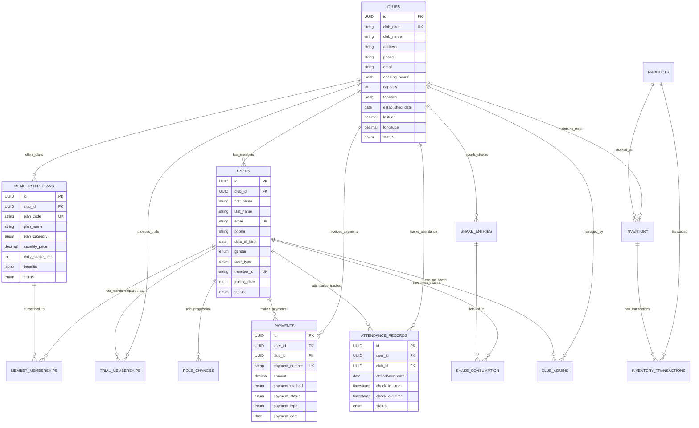

# Magical Community Database Schema

## Project Overview
This database schema supports the comprehensive Magical Community wellness and fitness hub management system, covering multi-club operations, member management, attendance tracking, shake distribution, financial transactions, inventory management, and role progression.

## Database Design Principles
- **Scalability**: Designed to support multiple clubs and unlimited growth
- **Data Integrity**: Comprehensive foreign key relationships and constraints
- **Audit Trail**: Created/updated timestamps on all core entities
- **Soft Deletes**: Logical deletion with `deleted_at` fields for data preservation
- **Performance**: Optimized indexes for frequent queries

---

## Core Tables

### 1. Clubs Table
```sql
CREATE TABLE clubs (
    id UUID PRIMARY KEY DEFAULT gen_random_uuid(),
    club_code VARCHAR(20) UNIQUE NOT NULL,
    club_name VARCHAR(255) NOT NULL,
    address_line1 VARCHAR(255) NOT NULL,
    address_line2 VARCHAR(255),
    city VARCHAR(100) NOT NULL,
    state VARCHAR(100) NOT NULL,
    pincode VARCHAR(10) NOT NULL,
    country VARCHAR(100) DEFAULT 'India',
    phone VARCHAR(20) NOT NULL,
    email VARCHAR(255) UNIQUE NOT NULL,
    website VARCHAR(255),
    
    -- Operational Details
    opening_hours JSONB, -- {"monday": "06:00-22:00", "tuesday": "06:00-22:00", ...}
    capacity INTEGER NOT NULL DEFAULT 200,
    facilities JSONB, -- ["Gym", "Yoga Studio", "Shake Bar", "Parking"]
    established_date DATE NOT NULL,
    
    -- Location Coordinates
    latitude DECIMAL(10, 8),
    longitude DECIMAL(11, 8),
    
    -- Subscription Details
    subscription_plan VARCHAR(50) DEFAULT 'Basic',
    subscription_valid_until DATE,
    max_members INTEGER DEFAULT 500,
    features JSONB, -- ["Advanced Analytics", "Multi-Admin Access"]
    
    -- Status
    status ENUM('active', 'inactive', 'suspended') DEFAULT 'active',
    
    -- Audit Fields
    created_at TIMESTAMP DEFAULT CURRENT_TIMESTAMP,
    updated_at TIMESTAMP DEFAULT CURRENT_TIMESTAMP ON UPDATE CURRENT_TIMESTAMP,
    created_by UUID,
    updated_by UUID,
    deleted_at TIMESTAMP NULL,
    
    INDEX idx_club_code (club_code),
    INDEX idx_club_status (status),
    INDEX idx_club_location (latitude, longitude)
);
```

### 2. Users Table
```sql
CREATE TABLE users (
    id UUID PRIMARY KEY DEFAULT gen_random_uuid(),
    club_id UUID NOT NULL,
    
    -- Personal Information
    first_name VARCHAR(100) NOT NULL,
    last_name VARCHAR(100) NOT NULL,
    email VARCHAR(255) UNIQUE,
    phone VARCHAR(20) NOT NULL,
    date_of_birth DATE,
    gender ENUM('male', 'female', 'other'),
    
    -- Address
    address JSONB, -- Complete address object
    emergency_contact JSONB, -- {"name": "...", "phone": "...", "relation": "..."}
    
    -- User Role and Status
    user_type ENUM('member', 'trial', 'visitor', 'coach', 'senior_coach', 'admin') NOT NULL,
    member_id VARCHAR(50) UNIQUE, -- Auto-generated member ID
    joining_date DATE NOT NULL,
    
    -- Health Information
    medical_conditions TEXT,
    fitness_goals TEXT,
    height_cm INTEGER,
    weight_kg DECIMAL(5,2),
    
    -- Authentication
    password_hash VARCHAR(255),
    last_login_at TIMESTAMP,
    login_attempts INTEGER DEFAULT 0,
    account_locked_until TIMESTAMP NULL,
    
    -- Profile
    profile_image_url VARCHAR(500),
    notes TEXT,
    referred_by UUID, -- Self-referential to users table
    
    -- Status
    status ENUM('active', 'inactive', 'suspended', 'expired') DEFAULT 'active',
    
    -- Audit Fields
    created_at TIMESTAMP DEFAULT CURRENT_TIMESTAMP,
    updated_at TIMESTAMP DEFAULT CURRENT_TIMESTAMP ON UPDATE CURRENT_TIMESTAMP,
    created_by UUID,
    updated_by UUID,
    deleted_at TIMESTAMP NULL,
    
    FOREIGN KEY (club_id) REFERENCES clubs(id) ON DELETE CASCADE,
    FOREIGN KEY (referred_by) REFERENCES users(id) ON DELETE SET NULL,
    
    INDEX idx_user_club (club_id),
    INDEX idx_user_type (user_type),
    INDEX idx_user_phone (phone),
    INDEX idx_user_email (email),
    INDEX idx_member_id (member_id),
    INDEX idx_user_status (status),
    UNIQUE KEY uk_phone_club (phone, club_id)
);
```

### 3. Membership Plans Table
```sql
CREATE TABLE membership_plans (
    id UUID PRIMARY KEY DEFAULT gen_random_uuid(),
    club_id UUID, -- NULL for global plans
    
    -- Plan Details
    plan_code VARCHAR(50) UNIQUE NOT NULL,
    plan_name VARCHAR(255) NOT NULL,
    plan_category ENUM('basic', 'silver', 'gold', 'platinum') NOT NULL,
    description TEXT,
    
    -- Pricing Structure
    monthly_price DECIMAL(10,2) NOT NULL,
    quarterly_price DECIMAL(10,2),
    annual_price DECIMAL(10,2),
    setup_fee DECIMAL(10,2) DEFAULT 0,
    
    -- Duration and Limits
    default_duration_months INTEGER DEFAULT 1,
    max_duration_months INTEGER DEFAULT 36,
    member_limit INTEGER, -- NULL for unlimited
    
    -- Benefits
    gym_access BOOLEAN DEFAULT true,
    personal_training_sessions INTEGER DEFAULT 0, -- per month
    group_classes BOOLEAN DEFAULT true,
    nutrition_consultation BOOLEAN DEFAULT false,
    
    -- Shake Allowances
    daily_shake_limit INTEGER DEFAULT 0,
    monthly_shake_limit INTEGER DEFAULT 0,
    premium_shakes_included BOOLEAN DEFAULT false,
    
    -- Additional Benefits
    benefits JSONB, -- Detailed benefits list
    restrictions JSONB, -- Any restrictions or conditions
    
    -- Validity
    valid_from DATE NOT NULL,
    valid_until DATE,
    
    -- Status
    status ENUM('active', 'inactive', 'draft') DEFAULT 'draft',
    
    -- Audit Fields
    created_at TIMESTAMP DEFAULT CURRENT_TIMESTAMP,
    updated_at TIMESTAMP DEFAULT CURRENT_TIMESTAMP ON UPDATE CURRENT_TIMESTAMP,
    created_by UUID NOT NULL,
    updated_by UUID,
    deleted_at TIMESTAMP NULL,
    
    FOREIGN KEY (club_id) REFERENCES clubs(id) ON DELETE CASCADE,
    
    INDEX idx_plan_club (club_id),
    INDEX idx_plan_category (plan_category),
    INDEX idx_plan_status (status),
    INDEX idx_plan_validity (valid_from, valid_until)
);
```

### 4. Member Memberships Table
```sql
CREATE TABLE member_memberships (
    id UUID PRIMARY KEY DEFAULT gen_random_uuid(),
    user_id UUID NOT NULL,
    membership_plan_id UUID NOT NULL,
    
    -- Membership Details
    membership_number VARCHAR(50) UNIQUE NOT NULL,
    start_date DATE NOT NULL,
    end_date DATE NOT NULL,
    
    -- Pricing (captured at time of signup)
    amount_paid DECIMAL(10,2) NOT NULL,
    payment_frequency ENUM('monthly', 'quarterly', 'annual') NOT NULL,
    
    -- Shake Allowances (copied from plan at signup)
    daily_shake_limit INTEGER DEFAULT 0,
    monthly_shake_limit INTEGER DEFAULT 0,
    shake_allowance_used INTEGER DEFAULT 0,
    shake_allowance_reset_date DATE,
    
    -- Status and Tracking
    status ENUM('active', 'expired', 'cancelled', 'suspended', 'renewed') NOT NULL,
    auto_renew BOOLEAN DEFAULT false,
    renewal_reminder_sent BOOLEAN DEFAULT false,
    
    -- Special Conditions
    freeze_start_date DATE,
    freeze_end_date DATE,
    freeze_reason TEXT,
    
    -- Payment Tracking
    next_payment_date DATE,
    last_payment_date DATE,
    outstanding_amount DECIMAL(10,2) DEFAULT 0,
    
    -- Audit Fields
    created_at TIMESTAMP DEFAULT CURRENT_TIMESTAMP,
    updated_at TIMESTAMP DEFAULT CURRENT_TIMESTAMP ON UPDATE CURRENT_TIMESTAMP,
    created_by UUID,
    updated_by UUID,
    deleted_at TIMESTAMP NULL,
    
    FOREIGN KEY (user_id) REFERENCES users(id) ON DELETE CASCADE,
    FOREIGN KEY (membership_plan_id) REFERENCES membership_plans(id) ON DELETE RESTRICT,
    
    INDEX idx_membership_user (user_id),
    INDEX idx_membership_plan (membership_plan_id),
    INDEX idx_membership_status (status),
    INDEX idx_membership_dates (start_date, end_date),
    INDEX idx_next_payment (next_payment_date)
);
```

### 5. Trial Memberships Table
```sql
CREATE TABLE trial_memberships (
    id UUID PRIMARY KEY DEFAULT gen_random_uuid(),
    user_id UUID NOT NULL,
    club_id UUID NOT NULL,
    
    -- Trial Details
    trial_name VARCHAR(255) NOT NULL,
    trial_duration_days INTEGER NOT NULL DEFAULT 7,
    amount_paid DECIMAL(10,2) NOT NULL DEFAULT 0,
    
    -- Dates
    start_date DATE NOT NULL,
    end_date DATE NOT NULL,
    extended_until DATE, -- If trial is extended
    
    -- Shake Allowances
    total_shake_allowance INTEGER DEFAULT 0,
    shakes_consumed INTEGER DEFAULT 0,
    daily_shake_limit INTEGER DEFAULT 1,
    
    -- Benefits During Trial
    benefits JSONB, -- Trial-specific benefits
    
    -- Conversion Tracking
    conversion_attempted BOOLEAN DEFAULT false,
    conversion_successful BOOLEAN DEFAULT false,
    converted_to_membership_id UUID,
    conversion_date DATE,
    conversion_discount DECIMAL(10,2) DEFAULT 0,
    
    -- Status
    status ENUM('active', 'expired', 'converted', 'cancelled', 'extended') NOT NULL,
    
    -- Extension Details
    extension_count INTEGER DEFAULT 0,
    max_extensions_allowed INTEGER DEFAULT 1,
    extension_fee_per_day DECIMAL(10,2) DEFAULT 0,
    
    -- Audit Fields
    created_at TIMESTAMP DEFAULT CURRENT_TIMESTAMP,
    updated_at TIMESTAMP DEFAULT CURRENT_TIMESTAMP ON UPDATE CURRENT_TIMESTAMP,
    created_by UUID,
    updated_by UUID,
    deleted_at TIMESTAMP NULL,
    
    FOREIGN KEY (user_id) REFERENCES users(id) ON DELETE CASCADE,
    FOREIGN KEY (club_id) REFERENCES clubs(id) ON DELETE CASCADE,
    FOREIGN KEY (converted_to_membership_id) REFERENCES member_memberships(id) ON DELETE SET NULL,
    
    INDEX idx_trial_user (user_id),
    INDEX idx_trial_club (club_id),
    INDEX idx_trial_status (status),
    INDEX idx_trial_dates (start_date, end_date),
    INDEX idx_conversion_status (conversion_successful)
);
```

### 6. Payments Table
```sql
CREATE TABLE payments (
    id UUID PRIMARY KEY DEFAULT gen_random_uuid(),
    user_id UUID NOT NULL,
    club_id UUID NOT NULL,
    
    -- Payment Reference
    payment_number VARCHAR(50) UNIQUE NOT NULL,
    receipt_number VARCHAR(50),
    
    -- Payment Details
    amount DECIMAL(10,2) NOT NULL,
    payment_method ENUM('cash', 'card', 'upi', 'net_banking', 'wallet') NOT NULL,
    payment_status ENUM('pending', 'completed', 'failed', 'refunded', 'cancelled') NOT NULL,
    
    -- Payment Gateway Details
    transaction_id VARCHAR(255),
    gateway_response JSONB, -- Store gateway response
    
    -- Payment Category
    payment_type ENUM('membership', 'trial', 'shake', 'personal_training', 'other') NOT NULL,
    payment_for VARCHAR(255), -- Description of what payment is for
    related_entity_id UUID, -- Reference to membership, trial, etc.
    related_entity_type VARCHAR(50), -- membership, trial, etc.
    
    -- Dates
    payment_date DATE NOT NULL,
    due_date DATE,
    
    -- Additional Details
    discount_amount DECIMAL(10,2) DEFAULT 0,
    tax_amount DECIMAL(10,2) DEFAULT 0,
    late_fee DECIMAL(10,2) DEFAULT 0,
    
    -- Notes and References
    notes TEXT,
    collected_by UUID, -- User who collected the payment
    
    -- Audit Fields
    created_at TIMESTAMP DEFAULT CURRENT_TIMESTAMP,
    updated_at TIMESTAMP DEFAULT CURRENT_TIMESTAMP ON UPDATE CURRENT_TIMESTAMP,
    created_by UUID,
    updated_by UUID,
    deleted_at TIMESTAMP NULL,
    
    FOREIGN KEY (user_id) REFERENCES users(id) ON DELETE CASCADE,
    FOREIGN KEY (club_id) REFERENCES clubs(id) ON DELETE CASCADE,
    FOREIGN KEY (collected_by) REFERENCES users(id) ON DELETE SET NULL,
    
    INDEX idx_payment_user (user_id),
    INDEX idx_payment_club (club_id),
    INDEX idx_payment_status (payment_status),
    INDEX idx_payment_type (payment_type),
    INDEX idx_payment_date (payment_date),
    INDEX idx_payment_number (payment_number)
);
```

### 7. Attendance Records Table
```sql
CREATE TABLE attendance_records (
    id UUID PRIMARY KEY DEFAULT gen_random_uuid(),
    user_id UUID NOT NULL,
    club_id UUID NOT NULL,
    
    -- Attendance Details
    attendance_date DATE NOT NULL,
    check_in_time TIMESTAMP,
    check_out_time TIMESTAMP,
    
    -- Attendance Status
    status ENUM('present', 'absent', 'late', 'half_day') NOT NULL DEFAULT 'present',
    marked_by UUID, -- User who marked the attendance
    
    -- Additional Information
    notes TEXT,
    temperature DECIMAL(4,1), -- For health monitoring
    
    -- Auto-generated fields
    duration_minutes INTEGER, -- Calculated from check-in/check-out
    
    -- Audit Fields
    created_at TIMESTAMP DEFAULT CURRENT_TIMESTAMP,
    updated_at TIMESTAMP DEFAULT CURRENT_TIMESTAMP ON UPDATE CURRENT_TIMESTAMP,
    created_by UUID,
    updated_by UUID,
    deleted_at TIMESTAMP NULL,
    
    FOREIGN KEY (user_id) REFERENCES users(id) ON DELETE CASCADE,
    FOREIGN KEY (club_id) REFERENCES clubs(id) ON DELETE CASCADE,
    FOREIGN KEY (marked_by) REFERENCES users(id) ON DELETE SET NULL,
    
    -- Composite unique constraint to prevent duplicate entries
    UNIQUE KEY uk_user_date (user_id, attendance_date),
    
    INDEX idx_attendance_user (user_id),
    INDEX idx_attendance_club (club_id),
    INDEX idx_attendance_date (attendance_date),
    INDEX idx_attendance_status (status),
    INDEX idx_attendance_club_date (club_id, attendance_date)
);
```

### 8. Products Table
```sql
CREATE TABLE products (
    id UUID PRIMARY KEY DEFAULT gen_random_uuid(),
    
    -- Product Information
    product_code VARCHAR(50) UNIQUE NOT NULL,
    product_name VARCHAR(255) NOT NULL,
    category ENUM('supplement', 'equipment', 'shake_ingredient', 'merchandise') NOT NULL,
    sub_category VARCHAR(100),
    
    -- Product Details
    description TEXT,
    brand VARCHAR(100),
    unit_of_measurement ENUM('kg', 'grams', 'liters', 'pieces', 'bottles') NOT NULL,
    
    -- Pricing
    cost_price DECIMAL(10,2),
    selling_price DECIMAL(10,2),
    
    -- Shake Specific Fields
    is_shake_ingredient BOOLEAN DEFAULT false,
    shake_types JSONB, -- ["protein", "energy", "recovery"] if used in shakes
    serving_size_grams DECIMAL(8,2), -- For shake calculations
    
    -- Product Status
    status ENUM('active', 'inactive', 'discontinued') DEFAULT 'active',
    
    -- Supplier Information
    supplier_name VARCHAR(255),
    supplier_contact JSONB, -- Supplier contact details
    
    -- Audit Fields
    created_at TIMESTAMP DEFAULT CURRENT_TIMESTAMP,
    updated_at TIMESTAMP DEFAULT CURRENT_TIMESTAMP ON UPDATE CURRENT_TIMESTAMP,
    created_by UUID,
    updated_by UUID,
    deleted_at TIMESTAMP NULL,
    
    INDEX idx_product_code (product_code),
    INDEX idx_product_category (category),
    INDEX idx_product_status (status),
    INDEX idx_shake_ingredient (is_shake_ingredient)
);
```

### 9. Inventory Table
```sql
CREATE TABLE inventory (
    id UUID PRIMARY KEY DEFAULT gen_random_uuid(),
    club_id UUID NOT NULL,
    product_id UUID NOT NULL,
    
    -- Stock Information
    current_stock DECIMAL(10,3) NOT NULL DEFAULT 0,
    minimum_stock_level DECIMAL(10,3) NOT NULL DEFAULT 0,
    maximum_stock_level DECIMAL(10,3),
    reorder_quantity DECIMAL(10,3),
    
    -- Cost Tracking
    average_cost_price DECIMAL(10,2),
    last_purchase_price DECIMAL(10,2),
    last_purchase_date DATE,
    
    -- Location in Club
    storage_location VARCHAR(100),
    
    -- Stock Alerts
    low_stock_alert_sent BOOLEAN DEFAULT false,
    last_alert_sent_date DATE,
    
    -- Audit Fields
    created_at TIMESTAMP DEFAULT CURRENT_TIMESTAMP,
    updated_at TIMESTAMP DEFAULT CURRENT_TIMESTAMP ON UPDATE CURRENT_TIMESTAMP,
    created_by UUID,
    updated_by UUID,
    deleted_at TIMESTAMP NULL,
    
    FOREIGN KEY (club_id) REFERENCES clubs(id) ON DELETE CASCADE,
    FOREIGN KEY (product_id) REFERENCES products(id) ON DELETE CASCADE,
    
    -- Composite unique constraint
    UNIQUE KEY uk_club_product (club_id, product_id),
    
    INDEX idx_inventory_club (club_id),
    INDEX idx_inventory_product (product_id),
    INDEX idx_low_stock (current_stock, minimum_stock_level)
);
```

### 10. Inventory Transactions Table
```sql
CREATE TABLE inventory_transactions (
    id UUID PRIMARY KEY DEFAULT gen_random_uuid(),
    club_id UUID NOT NULL,
    product_id UUID NOT NULL,
    
    -- Transaction Details
    transaction_type ENUM('purchase', 'consumption', 'adjustment', 'waste', 'transfer') NOT NULL,
    quantity DECIMAL(10,3) NOT NULL,
    unit_price DECIMAL(10,2),
    total_amount DECIMAL(10,2),
    
    -- Reference Information
    reference_type VARCHAR(50), -- 'shake_entry', 'purchase_order', 'adjustment'
    reference_id UUID, -- ID of related record
    
    -- Transaction Details
    transaction_date DATE NOT NULL,
    batch_number VARCHAR(100),
    expiry_date DATE,
    
    -- Additional Information
    supplier_name VARCHAR(255),
    notes TEXT,
    performed_by UUID,
    
    -- Before/After Stock for Audit
    stock_before DECIMAL(10,3),
    stock_after DECIMAL(10,3),
    
    -- Audit Fields
    created_at TIMESTAMP DEFAULT CURRENT_TIMESTAMP,
    updated_at TIMESTAMP DEFAULT CURRENT_TIMESTAMP ON UPDATE CURRENT_TIMESTAMP,
    created_by UUID,
    updated_by UUID,
    deleted_at TIMESTAMP NULL,
    
    FOREIGN KEY (club_id) REFERENCES clubs(id) ON DELETE CASCADE,
    FOREIGN KEY (product_id) REFERENCES products(id) ON DELETE CASCADE,
    FOREIGN KEY (performed_by) REFERENCES users(id) ON DELETE SET NULL,
    
    INDEX idx_inv_trans_club (club_id),
    INDEX idx_inv_trans_product (product_id),
    INDEX idx_inv_trans_type (transaction_type),
    INDEX idx_inv_trans_date (transaction_date),
    INDEX idx_inv_trans_reference (reference_type, reference_id)
);
```

### 11. Shake Entries Table
```sql
CREATE TABLE shake_entries (
    id UUID PRIMARY KEY DEFAULT gen_random_uuid(),
    club_id UUID NOT NULL,
    
    -- Entry Details
    entry_date DATE NOT NULL,
    
    -- Shake Counts
    member_shakes INTEGER NOT NULL DEFAULT 0,
    trial_shakes INTEGER NOT NULL DEFAULT 0,
    total_shakes INTEGER GENERATED ALWAYS AS (member_shakes + trial_shakes) STORED,
    
    -- Entry Metadata
    entry_notes TEXT,
    entered_by UUID,
    
    -- Inventory Impact (calculated fields)
    inventory_updated BOOLEAN DEFAULT false,
    inventory_update_date TIMESTAMP,
    
    -- Audit Fields
    created_at TIMESTAMP DEFAULT CURRENT_TIMESTAMP,
    updated_at TIMESTAMP DEFAULT CURRENT_TIMESTAMP ON UPDATE CURRENT_TIMESTAMP,
    created_by UUID,
    updated_by UUID,
    deleted_at TIMESTAMP NULL,
    
    FOREIGN KEY (club_id) REFERENCES clubs(id) ON DELETE CASCADE,
    FOREIGN KEY (entered_by) REFERENCES users(id) ON DELETE SET NULL,
    
    -- Composite unique constraint for date and club
    UNIQUE KEY uk_club_date (club_id, entry_date),
    
    INDEX idx_shake_club (club_id),
    INDEX idx_shake_date (entry_date),
    INDEX idx_shake_club_date (club_id, entry_date)
);
```

### 12. Individual Shake Consumption Table
```sql
CREATE TABLE shake_consumption (
    id UUID PRIMARY KEY DEFAULT gen_random_uuid(),
    user_id UUID NOT NULL,
    club_id UUID NOT NULL,
    
    -- Consumption Details
    consumption_date DATE NOT NULL,
    shake_count INTEGER NOT NULL DEFAULT 1,
    shake_type ENUM('protein', 'energy', 'recovery', 'weight_loss') DEFAULT 'protein',
    
    -- Cost and Payment
    cost_per_shake DECIMAL(8,2),
    total_cost DECIMAL(10,2),
    is_free_allowance BOOLEAN DEFAULT false, -- From membership allowance
    payment_required BOOLEAN DEFAULT false,
    
    -- Member Allowance Tracking
    membership_allowance_used INTEGER DEFAULT 0,
    remaining_allowance INTEGER DEFAULT 0,
    
    -- Reference to main entry
    shake_entry_id UUID,
    
    -- Additional Details
    notes TEXT,
    served_by UUID,
    
    -- Audit Fields
    created_at TIMESTAMP DEFAULT CURRENT_TIMESTAMP,
    updated_at TIMESTAMP DEFAULT CURRENT_TIMESTAMP ON UPDATE CURRENT_TIMESTAMP,
    created_by UUID,
    updated_by UUID,
    deleted_at TIMESTAMP NULL,
    
    FOREIGN KEY (user_id) REFERENCES users(id) ON DELETE CASCADE,
    FOREIGN KEY (club_id) REFERENCES clubs(id) ON DELETE CASCADE,
    FOREIGN KEY (shake_entry_id) REFERENCES shake_entries(id) ON DELETE SET NULL,
    FOREIGN KEY (served_by) REFERENCES users(id) ON DELETE SET NULL,
    
    INDEX idx_shake_cons_user (user_id),
    INDEX idx_shake_cons_club (club_id),
    INDEX idx_shake_cons_date (consumption_date),
    INDEX idx_shake_cons_type (shake_type),
    INDEX idx_shake_cons_entry (shake_entry_id)
);
```

### 13. Role Changes Table
```sql
CREATE TABLE role_changes (
    id UUID PRIMARY KEY DEFAULT gen_random_uuid(),
    user_id UUID NOT NULL,
    club_id UUID NOT NULL,
    
    -- Role Change Details
    previous_role ENUM('member', 'trial', 'visitor', 'coach', 'senior_coach', 'admin') NOT NULL,
    new_role ENUM('member', 'trial', 'visitor', 'coach', 'senior_coach', 'admin') NOT NULL,
    change_date DATE NOT NULL,
    
    -- Change Management
    change_reason TEXT,
    requested_by UUID,
    approved_by UUID,
    approval_date DATE,
    
    -- Probation Period
    probation_start_date DATE,
    probation_end_date DATE,
    probation_status ENUM('active', 'completed', 'failed') DEFAULT 'active',
    
    -- Performance Tracking
    performance_metrics JSONB, -- Store performance data at time of change
    member_feedback_score DECIMAL(3,2), -- Average feedback rating
    
    -- Status
    status ENUM('pending', 'approved', 'rejected', 'active', 'reverted') DEFAULT 'pending',
    
    -- Benefits Changes
    benefit_changes JSONB, -- Track what benefits changed with role
    
    -- Audit Fields
    created_at TIMESTAMP DEFAULT CURRENT_TIMESTAMP,
    updated_at TIMESTAMP DEFAULT CURRENT_TIMESTAMP ON UPDATE CURRENT_TIMESTAMP,
    created_by UUID,
    updated_by UUID,
    deleted_at TIMESTAMP NULL,
    
    FOREIGN KEY (user_id) REFERENCES users(id) ON DELETE CASCADE,
    FOREIGN KEY (club_id) REFERENCES clubs(id) ON DELETE CASCADE,
    FOREIGN KEY (requested_by) REFERENCES users(id) ON DELETE SET NULL,
    FOREIGN KEY (approved_by) REFERENCES users(id) ON DELETE SET NULL,
    
    INDEX idx_role_change_user (user_id),
    INDEX idx_role_change_club (club_id),
    INDEX idx_role_change_date (change_date),
    INDEX idx_role_change_status (status),
    INDEX idx_probation_status (probation_status)
);
```

### 14. Club Admins Table
```sql
CREATE TABLE club_admins (
    id UUID PRIMARY KEY DEFAULT gen_random_uuid(),
    user_id UUID NOT NULL,
    club_id UUID NOT NULL,
    
    -- Admin Role Details
    admin_type ENUM('super_admin', 'app_admin', 'club_manager') NOT NULL,
    
    -- Permissions
    permissions JSONB, -- Detailed permissions object
    
    -- Assignment Details
    assigned_date DATE NOT NULL,
    assigned_by UUID,
    
    -- Status
    status ENUM('active', 'inactive', 'suspended') DEFAULT 'active',
    
    -- Access Control
    last_access_date DATE,
    access_count INTEGER DEFAULT 0,
    
    -- Audit Fields
    created_at TIMESTAMP DEFAULT CURRENT_TIMESTAMP,
    updated_at TIMESTAMP DEFAULT CURRENT_TIMESTAMP ON UPDATE CURRENT_TIMESTAMP,
    created_by UUID,
    updated_by UUID,
    deleted_at TIMESTAMP NULL,
    
    FOREIGN KEY (user_id) REFERENCES users(id) ON DELETE CASCADE,
    FOREIGN KEY (club_id) REFERENCES clubs(id) ON DELETE CASCADE,
    FOREIGN KEY (assigned_by) REFERENCES users(id) ON DELETE SET NULL,
    
    -- Composite unique constraint
    UNIQUE KEY uk_user_club_admin (user_id, club_id),
    
    INDEX idx_club_admin_user (user_id),
    INDEX idx_club_admin_club (club_id),
    INDEX idx_club_admin_type (admin_type),
    INDEX idx_club_admin_status (status)
);
```

### 15. System Audit Logs Table
```sql
CREATE TABLE audit_logs (
    id UUID PRIMARY KEY DEFAULT gen_random_uuid(),
    
    -- Context
    table_name VARCHAR(100) NOT NULL,
    record_id UUID NOT NULL,
    club_id UUID,
    
    -- Action Details
    action ENUM('INSERT', 'UPDATE', 'DELETE', 'LOGIN', 'LOGOUT') NOT NULL,
    old_values JSONB,
    new_values JSONB,
    changed_fields JSONB, -- Array of changed field names
    
    -- User Context
    performed_by UUID,
    ip_address INET,
    user_agent TEXT,
    
    -- Additional Context
    notes TEXT,
    severity ENUM('low', 'medium', 'high', 'critical') DEFAULT 'medium',
    
    -- Timestamp
    created_at TIMESTAMP DEFAULT CURRENT_TIMESTAMP,
    
    FOREIGN KEY (performed_by) REFERENCES users(id) ON DELETE SET NULL,
    FOREIGN KEY (club_id) REFERENCES clubs(id) ON DELETE SET NULL,
    
    INDEX idx_audit_table (table_name),
    INDEX idx_audit_record (record_id),
    INDEX idx_audit_action (action),
    INDEX idx_audit_user (performed_by),
    INDEX idx_audit_date (created_at),
    INDEX idx_audit_club (club_id)
);
```

---

## Entity Relationship Diagram (ERD)



---

## Database Indexes and Performance Optimization

### Primary Indexes
```sql
-- Core entity lookups
CREATE INDEX idx_users_composite ON users (club_id, user_type, status);
CREATE INDEX idx_memberships_active ON member_memberships (user_id, status, end_date);
CREATE INDEX idx_payments_summary ON payments (club_id, payment_date, payment_type, payment_status);

-- Attendance queries
CREATE INDEX idx_attendance_analytics ON attendance_records (club_id, attendance_date, status);
CREATE INDEX idx_attendance_member ON attendance_records (user_id, attendance_date DESC);

-- Shake analytics
CREATE INDEX idx_shake_analytics ON shake_entries (club_id, entry_date DESC);
CREATE INDEX idx_shake_consumption_analytics ON shake_consumption (club_id, consumption_date, user_id);

-- Financial reporting
CREATE INDEX idx_financial_reporting ON payments (club_id, payment_date, payment_type, amount);

-- Role management
CREATE INDEX idx_role_tracking ON role_changes (user_id, change_date DESC, status);
```

### Data Archival Strategy
```sql
-- Archive old attendance records (older than 2 years)
CREATE TABLE attendance_records_archive LIKE attendance_records;

-- Archive old payments (older than 7 years for compliance)
CREATE TABLE payments_archive LIKE payments;

-- Archive old audit logs (older than 1 year)
CREATE TABLE audit_logs_archive LIKE audit_logs;
```

---

## Database Views for Common Queries

### 1. Active Members View
```sql
CREATE VIEW active_members_view AS
SELECT 
    u.id,
    u.club_id,
    u.first_name,
    u.last_name,
    u.phone,
    u.user_type,
    mm.membership_number,
    mm.end_date,
    mm.daily_shake_limit,
    mm.status as membership_status,
    c.club_name
FROM users u
JOIN member_memberships mm ON u.id = mm.user_id
JOIN clubs c ON u.club_id = c.id
WHERE u.status = 'active' 
AND mm.status = 'active'
AND mm.end_date >= CURRENT_DATE;
```

### 2. Monthly Revenue Summary View
```sql
CREATE VIEW monthly_revenue_summary AS
SELECT 
    c.club_name,
    YEAR(p.payment_date) as year,
    MONTH(p.payment_date) as month,
    p.payment_type,
    COUNT(*) as transaction_count,
    SUM(p.amount) as total_amount
FROM payments p
JOIN clubs c ON p.club_id = c.id
WHERE p.payment_status = 'completed'
GROUP BY c.club_name, YEAR(p.payment_date), MONTH(p.payment_date), p.payment_type;
```

### 3. Attendance Analytics View
```sql
CREATE VIEW attendance_analytics_view AS
SELECT 
    c.club_name,
    ar.attendance_date,
    COUNT(CASE WHEN ar.status = 'present' THEN 1 END) as present_count,
    COUNT(CASE WHEN ar.status = 'absent' THEN 1 END) as absent_count,
    COUNT(CASE WHEN ar.status = 'late' THEN 1 END) as late_count,
    COUNT(*) as total_members,
    ROUND((COUNT(CASE WHEN ar.status = 'present' THEN 1 END) * 100.0 / COUNT(*)), 2) as attendance_percentage
FROM attendance_records ar
JOIN clubs c ON ar.club_id = c.id
GROUP BY c.club_name, ar.attendance_date;
```

---

## Database Triggers and Constraints

### 1. Update User Role on Role Change Approval
```sql
DELIMITER $$
CREATE TRIGGER update_user_role_after_approval
AFTER UPDATE ON role_changes
FOR EACH ROW
BEGIN
    IF NEW.status = 'approved' AND OLD.status != 'approved' THEN
        UPDATE users 
        SET user_type = NEW.new_role,
            updated_at = CURRENT_TIMESTAMP
        WHERE id = NEW.user_id;
    END IF;
END$$
DELIMITER ;
```

### 2. Update Inventory After Shake Entry
```sql
DELIMITER $$
CREATE TRIGGER update_inventory_after_shake_entry
AFTER INSERT ON shake_entries
FOR EACH ROW
BEGIN
    -- Calculate ingredient consumption for protein shakes
    DECLARE protein_consumption DECIMAL(10,3);
    SET protein_consumption = (NEW.member_shakes + NEW.trial_shakes) * 0.030; -- 30g per shake
    
    -- Update protein powder inventory
    UPDATE inventory 
    SET current_stock = current_stock - protein_consumption,
        updated_at = CURRENT_TIMESTAMP
    WHERE club_id = NEW.club_id 
    AND product_id = (SELECT id FROM products WHERE product_code = 'PROTEIN_POWDER' LIMIT 1);
    
    -- Log inventory transaction
    INSERT INTO inventory_transactions (
        club_id, product_id, transaction_type, quantity, 
        reference_type, reference_id, transaction_date, 
        performed_by, created_at
    ) VALUES (
        NEW.club_id,
        (SELECT id FROM products WHERE product_code = 'PROTEIN_POWDER' LIMIT 1),
        'consumption',
        protein_consumption,
        'shake_entry',
        NEW.id,
        NEW.entry_date,
        NEW.entered_by,
        CURRENT_TIMESTAMP
    );
END$$
DELIMITER ;
```

### 3. Automatic Membership Expiry Check
```sql
DELIMITER $$
CREATE EVENT update_expired_memberships
ON SCHEDULE EVERY 1 DAY
STARTS CURRENT_TIMESTAMP
DO
BEGIN
    UPDATE member_memberships 
    SET status = 'expired', 
        updated_at = CURRENT_TIMESTAMP
    WHERE end_date < CURRENT_DATE 
    AND status = 'active';
    
    UPDATE users u
    JOIN member_memberships mm ON u.id = mm.user_id
    SET u.status = 'expired',
        u.updated_at = CURRENT_TIMESTAMP
    WHERE mm.status = 'expired'
    AND u.user_type = 'member'
    AND u.status = 'active';
END$$
DELIMITER ;
```

---

## Data Migration and Seeding Scripts

### 1. Initial Clubs Setup
```sql
INSERT INTO clubs (club_code, club_name, address_line1, city, state, pincode, phone, email, capacity, established_date, created_by) VALUES
('MC_MUM_001', 'Magical Community - Andheri West', '123 Wellness Street, Andheri West', 'Mumbai', 'Maharashtra', '400058', '+91-98765-43210', 'andheri@magicalcommunity.com', 200, '2025-01-15', (SELECT id FROM users WHERE email = 'superadmin@magicalcommunity.com' LIMIT 1)),
('MC_MUM_002', 'Magical Community - Bandra East', '456 Fitness Avenue, Bandra East', 'Mumbai', 'Maharashtra', '400051', '+91-98765-43211', 'bandra@magicalcommunity.com', 150, '2025-02-01', (SELECT id FROM users WHERE email = 'superadmin@magicalcommunity.com' LIMIT 1)),
('MC_PUN_001', 'Magical Community - Koregaon Park', '789 Health Plaza, Koregaon Park', 'Pune', 'Maharashtra', '411001', '+91-98765-43212', 'pune@magicalcommunity.com', 180, '2025-03-01', (SELECT id FROM users WHERE email = 'superadmin@magicalcommunity.com' LIMIT 1));
```

### 2. Default Membership Plans
```sql
INSERT INTO membership_plans (plan_code, plan_name, plan_category, monthly_price, quarterly_price, annual_price, daily_shake_limit, monthly_shake_limit, valid_from, status, created_by) VALUES
('PLAT_UMS', 'Platinum UMS Membership', 'platinum', 10000.00, 28500.00, 108000.00, 3, 90, '2025-01-01', 'active', (SELECT id FROM users WHERE email = 'superadmin@magicalcommunity.com' LIMIT 1)),
('GOLD_UMS', 'Gold UMS Membership', 'gold', 7500.00, 21375.00, 81000.00, 2, 60, '2025-01-01', 'active', (SELECT id FROM users WHERE email = 'superadmin@magicalcommunity.com' LIMIT 1)),
('SILVER_UMS', 'Silver UMS Membership', 'silver', 5000.00, 14250.00, 54000.00, 1, 30, '2025-01-01', 'active', (SELECT id FROM users WHERE email = 'superadmin@magicalcommunity.com' LIMIT 1)),
('BASIC_UMS', 'Basic UMS Membership', 'basic', 3000.00, 8550.00, 32400.00, 0, 0, '2025-01-01', 'active', (SELECT id FROM users WHERE email = 'superadmin@magicalcommunity.com' LIMIT 1));
```

### 3. Default Products
```sql
INSERT INTO products (product_code, product_name, category, unit_of_measurement, is_shake_ingredient, serving_size_grams, status, created_by) VALUES
('PROTEIN_POWDER', 'Whey Protein Powder', 'shake_ingredient', 'kg', true, 30.00, 'active', (SELECT id FROM users WHERE email = 'superadmin@magicalcommunity.com' LIMIT 1)),
('ENERGY_FORMULA', 'Energy Boost Formula', 'shake_ingredient', 'kg', true, 25.00, 'active', (SELECT id FROM users WHERE email = 'superadmin@magicalcommunity.com' LIMIT 1)),
('RECOVERY_MIX', 'Post-Workout Recovery Mix', 'shake_ingredient', 'kg', true, 35.00, 'active', (SELECT id FROM users WHERE email = 'superadmin@magicalcommunity.com' LIMIT 1)),
('WEIGHT_LOSS', 'Weight Management Formula', 'shake_ingredient', 'kg', true, 28.00, 'active', (SELECT id FROM users WHERE email = 'superadmin@magicalcommunity.com' LIMIT 1));
```

---

## Backup and Maintenance Procedures

### Daily Backup Script
```bash
#!/bin/bash
# Daily backup script
DATE=$(date +%Y%m%d_%H%M%S)
BACKUP_DIR="/backups/magical_community"
DB_NAME="magical_community_db"

# Create backup directory if it doesn't exist
mkdir -p $BACKUP_DIR

# Full database backup
mysqldump --single-transaction --routines --triggers $DB_NAME > $BACKUP_DIR/full_backup_$DATE.sql

# Compress backup
gzip $BACKUP_DIR/full_backup_$DATE.sql

# Remove backups older than 30 days
find $BACKUP_DIR -name "full_backup_*.sql.gz" -mtime +30 -delete

echo "Backup completed: full_backup_$DATE.sql.gz"
```

### Database Maintenance Tasks
```sql
-- Weekly maintenance script

-- Analyze tables for optimal performance
ANALYZE TABLE clubs, users, member_memberships, payments, attendance_records;

-- Optimize tables to reclaim space
OPTIMIZE TABLE attendance_records, payments, inventory_transactions;

-- Update statistics
FLUSH TABLES;

-- Check for data integrity issues
SELECT 'Orphaned payments' as issue_type, COUNT(*) as count 
FROM payments p 
LEFT JOIN users u ON p.user_id = u.id 
WHERE u.id IS NULL;

SELECT 'Expired memberships not updated' as issue_type, COUNT(*) as count
FROM member_memberships 
WHERE end_date < CURRENT_DATE AND status = 'active';
```

---

## Summary

This comprehensive database schema supports all features of the Magical Community application including:

- **Multi-club management** with location-specific operations
- **Member lifecycle tracking** from visitor to senior coach
- **Attendance monitoring** with date-specific tracking and analytics
- **Shake consumption management** with allowance tracking and inventory integration
- **Financial management** with payment processing and revenue analytics
- **Inventory control** with automated stock updates and reorder alerts
- **Role progression systems** with approval workflows and probation periods
- **Comprehensive audit trails** for all system activities

The schema is designed for **scalability**, **performance**, and **data integrity** while maintaining comprehensive audit trails and supporting advanced analytics requirements for the CMS dashboard and mobile application operations.
